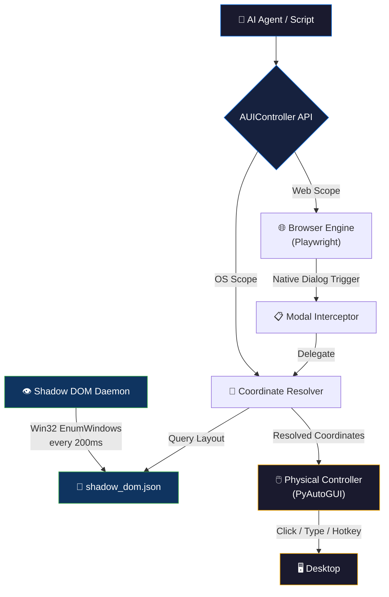

<div align="center">
  
</div>

<br>

<div align="center">

[](https://github.com/axtontc/AUI/releases)
[](https://python.org)
[](https://opentelemetry.io)
[](LICENSE)
[](https://github.com/axtontc/AUI/actions)

</div>

<br>

<h1 align="center">AUI — Unified UI Controller for AI Agents</h1>

<p align="center">
  <strong>A zero-latency, cross-process UI automation system that bridges the gap between web browsers, native OS windows, and system dialogs — giving AI agents complete desktop control through a single Python API.</strong>
</p>

<p align="center">
  <a href="#-quick-start">Quick Start</a> •
  <a href="#-why-aui">Why AUI?</a> •
  <a href="#-architecture">Architecture</a> •
  <a href="#-api-reference">API Reference</a> •
  <a href="#-telemetry">Telemetry</a> •
  <a href="#-roadmap">Roadmap</a> •
  <a href="#-contributing">Contributing</a>
</p>

---

## 🤔 The Problem

Modern AI agents (Copilot, Devin, custom LLM pipelines) can automate web browsers with tools like Playwright or Selenium — but they **hit a wall** the moment the OS takes over:

- A **file upload dialog** appears? Playwright can't see it.
- A **system confirmation popup** blocks execution? Selenium has no answer.
- Need to **click a native Windows button** outside the browser? You're writing fragile `pyautogui` scripts with hardcoded coordinates.

These tools operate in isolated sandboxes. The OS desktop is invisible to them.

## 💡 The Solution

**AUI** eliminates this blind spot. It continuously scans every visible window on the desktop using native Win32 APIs, builds a real-time coordinate map (`shadow_dom.json`), and resolves exact pixel locations for any UI element — browser or native. When your AI agent needs to click a file dialog's "Open" button, AUI knows exactly where it is.

```
┌─────────────────────────────────────────────────────┐
│                    Your AI Agent                    │
│                                                     │
│   from aui_controller import AUIController          │
│   aui = AUIController()                             │
│   aui.click_element("Open", "Open")  # Native OS!   │
│                                                     │
└───────────────┬─────────────────────────────────────┘
                │
    ┌───────────▼───────────┐
    │   AUI Controller API  │  ← Single entry point
    ├───────────────────────┤
    │ Browser │ OS Desktop  │  ← Unified control
    │ Engine  │ Controller  │
    ├─────────┴─────────────┤
    │  Shadow DOM Daemon    │  ← Real-time Win32 scanner
    │  (shadow_dom.json)    │     200ms refresh cycle
    └───────────────────────┘
```

---

## ⚡ Quick Start

### Prerequisites

- **Windows 10/11** (Win32 APIs required for native window scanning)
- **Python 3.10+**
- **Git**

### 1. Clone & Install

```bash
git clone https://github.com/axtontc/AUI.git
cd AUI

# Using uv (recommended)
uv venv && uv pip install -r requirements.txt

# Or using pip
python -m venv .venv && .venv\Scripts\activate
pip install -r requirements.txt

# Install Playwright browsers
playwright install chromium
```

### 2. Start the Shadow DOM Daemon

In a separate terminal, launch the background scanner:

```bash
.venv\Scripts\python shadow_dom_daemon.py
```

> This continuously scans all visible windows and writes their layout state to `shadow_dom.json` every 200ms.

### 3. Automate Everything

```python
import asyncio
from playwright.async_api import async_playwright
from aui_controller import AUIController

async def main():
    aui = AUIController()

    # === Web Automation (Playwright) ===
    async with async_playwright() as p:
        browser = await p.chromium.launch(headless=False)
        page = await browser.new_page()
        await page.goto("https://example.com/upload")

        # === Native Dialog Handling (AUI magic) ===
        # When the file chooser dialog pops up, AUI finds and fills it
        success = await aui.handle_file_chooser(page, "#upload-btn", "report.pdf")
        print(f"Native dialog handled: {success}")  # True!

        await browser.close()

asyncio.run(main())
```

### 4. Click Any Native UI Element

```python
from aui_controller import AUIController

aui = AUIController()

# Find and click any element by window title + element name
aui.click_element("Notepad", "File")      # Click File menu in Notepad
aui.click_element("Save As", "Save")      # Click Save in a Save As dialog

# Get exact coordinates for any element
coords = aui.get_element_coords("Calculator", "Seven")
print(coords)  # {"x": 523, "y": 412}

# Query by Win32 class name
edit_box = aui.get_element_by_class("Open", "Edit")
if edit_box:
    aui.physical_click(edit_box["x"], edit_box["y"])
    aui.physical_type("C:\\path\\to\\file.txt")
```

---

## 🏗️ Architecture

AUI integrates four subsystems into a single cohesive runtime:



### Core Subsystems

| Subsystem | File | Responsibility |
|---|---|---|
| **Browser Engine** | `aui_controller.py` | Runs Playwright web sessions, automates DOM interactions, intercepts native dialogs |
| **Shadow DOM Daemon** | `shadow_dom_daemon.py` | Background process using Win32 `EnumWindows` + `EnumChildWindows` to continuously map every visible window, control, and coordinate boundary |
| **Coordinate Resolver** | `aui_controller.py` | Parses `shadow_dom.json`, resolves absolute screen-center coordinates, and uses `filelock` to ensure cross-process read safety |
| **Physical Controller** | `aui_controller.py` | Triggers low-level mouse clicks, keyboard input, and hotkey sequences at exact pixel coordinates via PyAutoGUI |

---

## 📊 Why AUI? — Comparison

| Capability | Playwright | Selenium | PyAutoGUI | **AUI** |
|---|:---:|:---:|:---:|:---:|
| Web DOM automation | ✅ | ✅ | ❌ | ✅ |
| Native OS dialog handling | ❌ | ❌ | ⚠️ Manual | ✅ Auto |
| Real-time window tracking | ❌ | ❌ | ❌ | ✅ |
| Coordinate resolution | ❌ | ❌ | ⚠️ Hardcoded | ✅ Dynamic |
| Cross-process file locking | ❌ | ❌ | ❌ | ✅ |
| OpenTelemetry tracing | ❌ | ❌ | ❌ | ✅ |
| AI agent integration | ⚠️ Partial | ⚠️ Partial | ⚠️ Fragile | ✅ Native |

> **AUI doesn't replace Playwright** — it extends it. Playwright handles the browser. AUI handles everything Playwright can't see.

---

## 📖 API Reference

### `AUIController`

```python
aui = AUIController(shadow_dom_path="shadow_dom.json")
```

| Method | Description | Returns |
|---|---|---|
| `read_state()` | Read the current shadow DOM state (all tracked windows) | `dict` |
| `get_element_coords(window_title, element_name)` | Find element center coordinates by fuzzy name match | `{"x": int, "y": int}` or `None` |
| `get_element_by_class(window_title, class_name, name_query=None)` | Find element by Win32 class name | `{"x": int, "y": int}` or `None` |
| `click_element(window_title, element_name)` | Locate and physically click an element | `bool` |
| `physical_click(x, y, button='left', clicks=1)` | Click at exact screen coordinates | `None` |
| `physical_type(text)` | Type text with character intervals | `None` |
| `physical_hotkey(keys_str)` | Execute hotkey combo (e.g., `"ctrl,a"`) | `None` |
| `handle_file_chooser(page, click_target, file_path)` | **Async** — Handle native file dialog from Playwright | `bool` |

### `ShadowDOMDaemon`

```python
daemon = ShadowDOMDaemon(output_path="shadow_dom.json")
daemon.start()   # Launch background scanner
daemon.stop()    # Stop scanner and clean up
```

---

## 📈 Telemetry & Monitoring

AUI includes production-grade observability via OpenTelemetry. Every operation — state reads, element lookups, file lock acquisitions, click executions — is traced with span timing.

### Local Monitoring with Jaeger

```bash
# Start AUI + Jaeger with a single command
docker-compose up --build
```

Then open **http://localhost:16686** to see:
- Span execution latencies for every AUI operation
- File lock contention timing
- Element resolution success/failure rates

### Configuration

| Environment Variable | Default | Description |
|---|---|---|
| `OTEL_EXPORTER_OTLP_ENDPOINT` | *(none)* | OTLP gRPC endpoint (e.g., `http://jaeger:4317`) |
| `AUI_DEBUG_TELEMETRY` | *(none)* | Set to `1` to enable console span logging |

---

## 🗺️ Roadmap

- [x] Win32 `EnumWindows` real-time scanner
- [x] Cross-process `filelock` state management
- [x] Playwright file dialog interception
- [x] OpenTelemetry instrumentation
- [x] Docker + Jaeger compose stack
- [ ] **UIAutomation v2** — Replace raw Win32 with `comtypes` UIAutomation for richer element properties (AutomationId, ControlType)
- [ ] **Multi-monitor support** — Coordinate resolution across multiple displays
- [ ] **Linux/X11 backend** — `xdotool` + `wmctrl` equivalent daemon
- [ ] **Element screenshot caching** — Visual matching fallback when text/class queries fail
- [ ] **PyPI package** — `pip install aui`
- [ ] **WebSocket API** — Remote AUI control over the network

---

## 🧰 Tech Stack

| Component | Technology |
|---|---|
| Language | Python 3.10+ |
| Web Automation | Playwright |
| Desktop Input | PyAutoGUI |
| Window Scanning | Win32 API (ctypes) |
| Process Locking | filelock |
| Telemetry | OpenTelemetry + Jaeger |
| Linting | Ruff |
| Type Checking | mypy (strict) |
| Testing | pytest + pytest-asyncio |
| Containerization | Docker + Docker Compose |

---

## 🤝 Contributing

Contributions are welcome! Whether it's fixing a bug, improving documentation, or proposing a new feature — we'd love your help.

Please read our [Contributing Guide](CONTRIBUTING.md) and [Code of Conduct](CODE_OF_CONDUCT.md) before getting started.

```bash
# Development setup
git clone https://github.com/axtontc/AUI.git
cd AUI
uv venv && uv pip install -r requirements.txt
uv pip install -e ".[test]"

# Run checks
ruff check .
mypy .
pytest
```

---

## 🔗 Related Projects

AUI is part of a larger ecosystem of AI agent infrastructure:

| Project | Description |
|---|---|
| [The-Nexus](https://github.com/axtontc/The-Nexus) | Monolithic API server for Ollama — system mapping, task farming, and tool orchestration |
| [The-Skillbrary](https://github.com/axtontc/The-Skillbrary) | Enterprise MCP server indexing 6,000+ autonomous agent skills |
| [Fractal-Swarm-v2](https://github.com/axtontc/Fractal-Swarm-v2) | State-machine framework for autonomous AI agent orchestration |
| [AntiMem](https://github.com/axtontc/AntiMem) | Context-gated memory daemon with CRDT compaction |
| [OmniMem](https://github.com/axtontc/OmniMem) | Hybrid memory engine for massive AI agent swarms |

---

## 📜 License

This project is licensed under the [PolyForm Noncommercial 1.0.0](LICENSE) license.

> **Note:** This license permits personal, hobbyist, and academic use. Commercial use requires a separate license — [open an issue](https://github.com/axtontc/AUI/issues) to discuss commercial licensing.

---

<div align="center">
  <br>
  <strong>⭐ If AUI helps your AI agents see beyond the browser, consider giving it a star!</strong>
  <br>
  <br>
  <a href="https://github.com/axtontc/AUI">
    
  </a>
  <br>
  <br>
  <sub>Built by <a href="https://github.com/axtontc">Axton Carroll</a> — "Nothing is impossible, we merely don't know how to do it yet."</sub>
</div>
