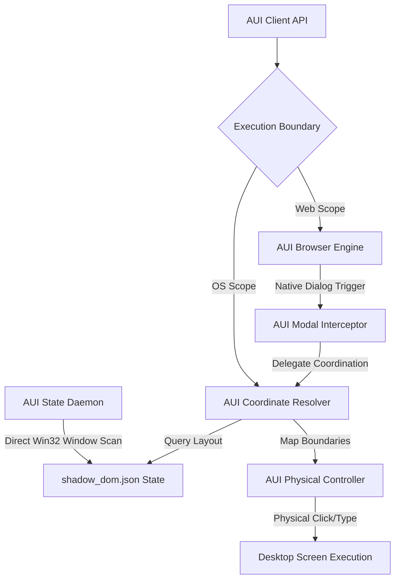

<div align="center">
  
</div>

<br>

<div align="center">
  
  
  
  
</div>

<br>

<h2 align="center">AUI: AOS Unified UI Controller</h2>

**AUI** is a zero-latency, cross-process UI automation system that provides a unified, self-contained architecture for seamlessly orchestrating web browser sessions, native OS windows, and system dialogs.

---

## 🎨 System Architecture

AUI integrates window tracking, coordinate resolution, and physical input automation into a single, cohesive runtime:



---

## ⚡ Core Subsystems

AUI is comprised of four tightly integrated internal components:

1. **AUI Browser Engine**: Runs Playwright web sessions to automate dynamic web apps and DOM interactions.
2. **AUI State Daemon**: Runs a non-blocking background scanner utilizing native Win32 `EnumWindows` and `EnumChildWindows` calls to continuously map window states.
3. **AUI Coordinate Resolver**: Parses cached layout structures, resolves absolute screen centers, and locks read/write file streams with `filelock` to eliminate click-drift.
4. **AUI Physical Controller**: Triggers low-level system keyboard/mouse events at exact coordinates, bypassing sandbox display limits.

---

## 🚀 Quick Start

### 1. Installation
Clone the repository and install dependencies using `uv` or `pip`:
```bash
git clone https://github.com/axtontc/AUI.git
cd AUI
uv venv
uv pip install -r requirements.txt
```

### 2. Run the AUI State Daemon
Start the background scanner:
```bash
.venv/Scripts/python shadow_dom_daemon.py
```

### 3. Basic Usage
Import the unified `AUIController` inside your automation scripts:
```python
import asyncio
from playwright.async_api import async_playwright
from aui_controller import AUIController

async def main():
    aui = AUIController()
    
    async with async_playwright() as p:
        browser = await p.chromium.launch(headless=False)
        page = await browser.new_page()
        await page.goto("file:///C:/path/to/upload_test.html")
        
        # Intercept and handle native dialogs using AUI's layout state
        success = await aui.handle_file_chooser(page, "#file_picker", "data.txt")
        print(f"Dialog handled: {success}")
        
        await browser.close()

if __name__ == "__main__":
    asyncio.run(main())
```

---

## 📊 Telemetry & Monitoring

AUI has built-in telemetry using OpenTelemetry. Traces can be exported directly to a Jaeger dashboard:

1. **Start Jaeger & AUI via Docker Compose**:
   ```bash
   docker-compose up --build
   ```
2. **Access the Jaeger UI**: Open `http://localhost:16686` to monitor span execution latencies and transaction lock timings.

---

## 📜 Licensing & Usage

This project is licensed under the **PolyForm Noncommercial 1.0.0** license. 

> [!WARNING]
> This codebase is explicitly prohibited from being used in commercial, enterprise, or corporate environments without express authorization and commercial licensing.

---
<div align="center">
  <i>"Nothing is impossible, we merely don't know how to do it yet."</i>
</div>
